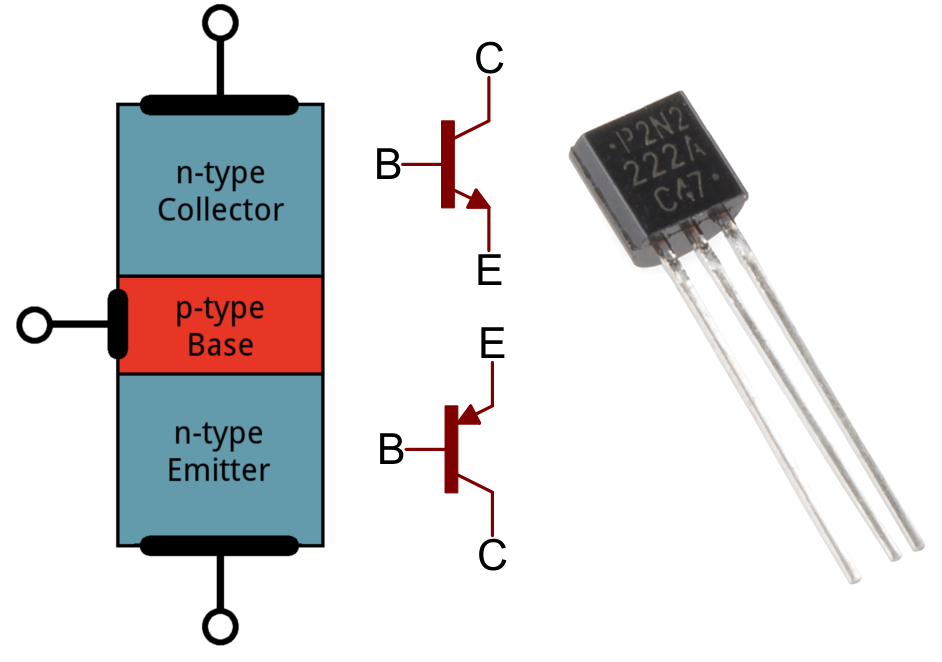

## Programming 2 : Lab 1
### By `TA Ahmed Arafat` (Ahmed Mohamed Yousry)

### Topics To Be Discussed:
#### 00. Some Important Points About Our Lab
#### 00. Some Important Points About Our Lab
#### 00. Some Important Points About Our Lab
#### 00. Some Important Points About Our Lab
#### 00. Some Important Points About Our Lab

### 00. Some Important Points About Our Lab
- The Attendance is quite important for me, because ut shows how you are committed and discipline towards the course &
of course because are labs depends on each other which means that being an absent in one lab will 
definitely affect the understanding of the other one. Also, it will hugely affect your grades in the final
project/practical, for example if you attended most of our labs, but you got 12/15 in the final project, I will raise you to 15. 
I think know you realized how important it is LOL.  
`VIP Note`: attending less than 50% of the labs will mean that you will not have a final project, `Be Caruful`

- I want from you all to Create accounts on:
1. GitHub `Dont forget to follow me :)` 
2. Codeforces
3. HackerRank
We will solve some problem on them
- For each lab you will have 2 things, the lab recorded on YouTube & a documentation on GitHub (Just like what you are reading)
- Programming is like going to the gym, imagine you have a championship about bodybuilding, and you have  months to practice,
it doesn't make any sense to what all 89 days and then in the day before the championship you decided to go to the gym and workout for 6 continues hours, 
this is not gonna work AT ALL, the same is applied to the programming you have to practice at least 2 hours each week + attending the lecture & the lab each week,
so that your brain become familiar with the syntax and reading/writing code & most important to learn how to think and how to
convert your ideas into working code

- Programming is 99% logic, 1% memorizing the syntax. We are not going to memorize a dozen of chapters or pages that you have to memorize in order to 
solve the final exam, this is not the programming at all, it all depends on logic & PRACTICING
- Your life in the tech field depends on your programming level, this is a fact that you gonna realize later
- For each lab, there will be an assignment to practice `^-^`

## 0. Most Important Courses In The College `VIP`
- From my point of view (which depends on the market & the field),  the most important courses you will take in the college are (ranked from the most to the least):
1. Programming X (X means Programming 1/2/3)
2. Database X (X means 1/2)
3. Operating System X (X Means 1/2)
4. Network X (X means Network 1/2)
5. Data Security (System Security)
6. System Analysis
- These courses are the fundamental of information technology & software engineering fields,
  so that you have to study them well, not just to get an `A+` in the course, but to finish the course
  with maximum benefits from them

## 1. What is The Programming ?
- If I told you to define the Computer (programming) to a child, that will you say??
- Simply, programming is typing some words (statements) that are understandable by the machine (computer) to perform some task (solve a problem) instead of me (as a human being)
- This is the easiest & most forward definition of programming
## 2. Why Computer (Programming) exists in this life ?
- Or we can say in other word, what is the properties or the advantage of the programming (computer) compared to us as humans
- There are 4 main advantage of the computer:
1. `Speed`: if I told you to play with me a gain, if I told you to calculate in your mind the summation of numbers from `1 to 5`
then you will think for a while then you wil answer with `15`, but if i told you to get the summation this time from `1 to 1,000,000`, then you will be shocked.
When you learn how to code we will write this simple program to calculate the summation from 1 to N, the computer you will see will calculate it in a blank,
but you have to note that the computer is not smart like us, it just executes the commands we till him, not more not less, if your commands
are logically right then the output will be right otherwise don't expect a desired output
2. `Error Ratio`: We as humans may be exhausted, tired, not in a good mood, having problems in our live, not sleeping well, all the previous examples can cause the human to make error(s) or mistake(s)
while performing a task, unlike humans the computer does not cause eny errors, to be more specific in the previous example (calculate numbers from `1 to N`) you have the same statements (code) and you entered number `5`, the
output each time will be `15`, it cannot be 16 in the tenth attempt. Imagine you are trying to log in your facebook account,
can you login if you entered a password wrong, can the server makes a mistake and pass you, this is a fatal problem, so it cannot be happened 
3. `Availability`: If I told you to solve mathematical problems for 1 hour directly, you will not have any problem, but if I told you to solve problems for 12 hours, you will call me a mad person, that's because we humans
cannot work continuously for many hours directly. However, The server (huge computer) can work 24 hours a day, 7 days a week. Briefly `Server-Client` means that for example whenever you want to view for example your profile on facebook,
you send a `request` to the facebook server telling him you want to view (access) this page, the facebook check that you have the 
authority view this resource, and  if so it will perform an `SQL` query to get
your data something like this : `SELECT * FROM users WHERE ID = YourFaceBookID`, then the result query will be sent to you back as a `response`. This means that it can serve anyone at anytime
4. `Concurrency`: We as humans can perform one task at a single time,it is impossible to read a book while cooking or study will watch a movie, out brain is designed to concentrate on only on thing
, this is for humans while machines (computer) can perform many tasks (commands) at the same time, this concept is called `concurrency` or `multithreading`. Regard the above example, the facebook server serve billions of users
or as we said above (`requests`) each second. 

## 3. History Of The Computer Briefly
- During the World War II(1939-1945), the nazis was having the advantage & the upper hand for many reasons, but one of the most important & critical one
is that all of their radio messages that are sent to the soldiers in the battlefield was `Encrypted`, this means that if the message (`Plaintext` is the readable text by human)
is `hi` the message sent in the radio will be for example `zl` (this is called the Ciphertext which is the plaintext after encryption), so even if the allies can interpret radio waves (messages),
they cannot understand anything. In this time a Mathematician called `Alan Turing` with his team was trying to invent a machine that can
break the cryptography of the enigma machine (machine used by nazis to encrypt text), they succeeded to build a machine called
`Bombe` (refers to a device that British cryptologists used to decipher encrypted German military communications during World War II).
This machine was able to use logic to decipher the encrypted messages produced by the Enigma. experts assume that is invention has shortened length of the ware for at least 5 years, `Alan Turing` was the godfather of computers nowadays
- then after a device called `vacuum tube` was the fundamental unit of first generation of the computer (when the computer size was enormous that occupies a whole room) , it acts as a `switch` which means that it can turn on/off current  (`1`/`0` statues), and using logic gates it was used
to process simple instructions, but the problem with it is that it was huge, easily heated, damaged easily & of course slow 

First Generation Of Computers

Vacuum Tube

- In the current era, the fundamental unit of the computer's processor is `Transistor` which is
a semiconductor device for amplifying, controlling, and generating electrical signals
- A single processor (`CPU`) contains billions of transistors that process & executes instructions

Transistor

Modern CPUs

Billions Of Transistors Inside A CPU

## 4. Computer Main Components
- The Main 3 Hardware components are `CPU`,`RAM` & `Hard Disk`,they are connected to each other by the help of `Motherboard`

  
Computer Main Components

## 5. What Actually Happens When A Program Is Run ?
- When you as a user click on `Word` program, word program data is
stored **permanently** on `Hard Disk` (assume word is 10GB storage in `HDD`), permanently means that is the current is off from your computer,
your data will still be stored (Also Can be called Nonvolatile). When you click on the program, main statements that must be executed in order for the program to
run will be copied from `Hard Disk` to `RAM`, The `RAM` is a temporally (volatile) memory which means that when you turned of the PC of the current is off, all the data inside it will be vanished. let's assume that
from `10GB` of word only `2GB` will be copied to the `RAM`, now the `RAM` will send these instructions to the `CPU` which will process the instruction that will be sent again to the `RAM` to be temporarily stored, if a data inside
the `RAM` should be stored permanently then it will be copied from `RAM` to `Hard Disk`, and when toy close the program the data of that program will be removed from the `RAM` 

  
Running Word Program

- The logical question here is why do `RAM` exists, why CPU not interacting directly with `HDD` ?!
- The problem here is that the `CPU` is so fast while the `HDD` is so slow. When a fast hardware component interacts with other slow components,
the fast component will decrease its speed to be compatible with the slower component, this phenomenon is called `bottleneck`. This means no matter
the speed of the `CPU` it will be, we won't be able to utilize this speed no matter what, so that the `RAM` is invented that is way faster than the `HDD`
& at the same type has an enough space (4-32GB) not like `CPU`'s cache which might be only `8MB` 

## 6. Logical Structure of the RAM
  
## 7. C++ Vs Java (Syntax Vs Principles)
## 8. Why we prefer using java in Prog. 2 ?
## 9. So, Is it really hard to learn Java ?
## 10. Structure of C++ Program
## 11. Data Types in C++
## 12. Physical Structure of the RAM
## 13. Run Time Vs Compile Time
## 14. What happens in the main memory when we run a C++ program

